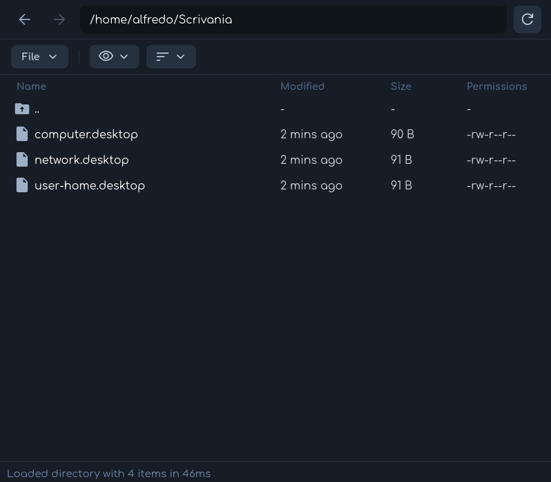
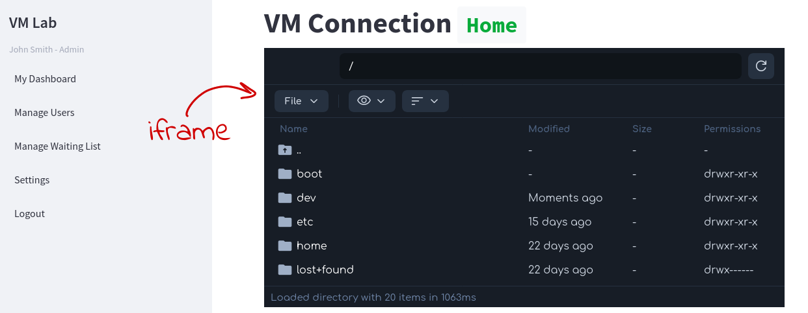

# alfresco-sftp

## Welcome

**alfresco-sftp** is a web-based file explorer for SFTP connections. It is a fork of [CyberGen49/sftp-browser](https://github.com/CyberGen49/sftp-browser).

## Features

- **Web-based SFTP file explorer**: Browse, upload, download, rename, move, copy, and delete files and folders on any SFTP server.
- **Modern UI**: Responsive, mobile-friendly interface with list and tile views thanks to the original author's CSS.
- **Drag & drop**: Upload files and folders via drag-and-drop.
- **File preview**: View text, images, and other common file types directly in the browser.
- **Clipboard operations**: Cut, copy, and paste files and folders between directories.
- **Batch actions**: Select multiple files/folders for batch operations.
- **Permissions management**: View and change file and folder permissions.
- **Download as ZIP**: Download multiple files/folders as a ZIP archive.
- **Session persistence**: Remembers your last connection and view settings.
- **Iframe friendly**: The file explorer is an HTML page, so you can include it on other websites.

## Other modules
This project is part of a modular architecture called **VM Lab**. Find out more about it [here](https://github.com/isislab-unisa/vm-lab/wiki/The-External-Modules).

- [VM Lab](https://github.com/isislab-unisa/vm-lab)
- [SFTP Module](https://github.com/isislab-unisa/alfresco-sftp)

## Documentation

Full documentation and guides are available in the [Wiki](https://github.com/isislab-unisa/alfresco-sftp/wiki).

## Contributing

- See [Contributing-To-The-Wiki](https://github.com/isislab-unisa/alfresco-sftp/wiki/Contributing-To-The-Wiki) for documentation standards and contribution guidelines.
- Issues and feature requests are welcome!

## License

[MIT License](LICENSE)
